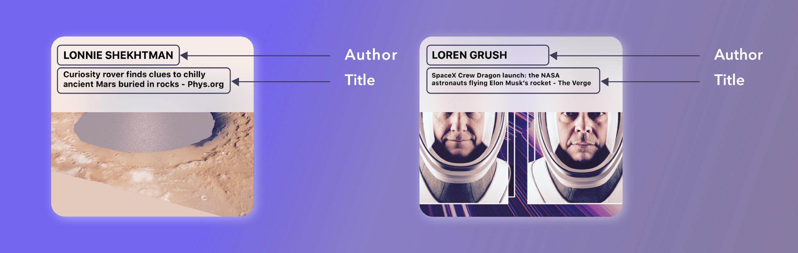

# Build a Positive News iOS Application Using the Incredible Power of Machine Learning
> How You Can Effortlessly Create Your Own Positive News iOS Application 

The project consists of an iOS application that will consume an API and select the most positive articles. The application uses the built-in `Natural Language` API to perform the sentiment analysis inference on the articles's text.

## Final result

## Article structure

## About me

Omar MHAIMDAT – [Linkedin](https://www.linkedin.com/in/omarmhaimdat/) – omarmhaimdat@gmail.com

Distributed under the MIT license. See ``LICENSE`` for more information.

[Look at the rest of my repos](https://github.com/omarmhaimdat/)
